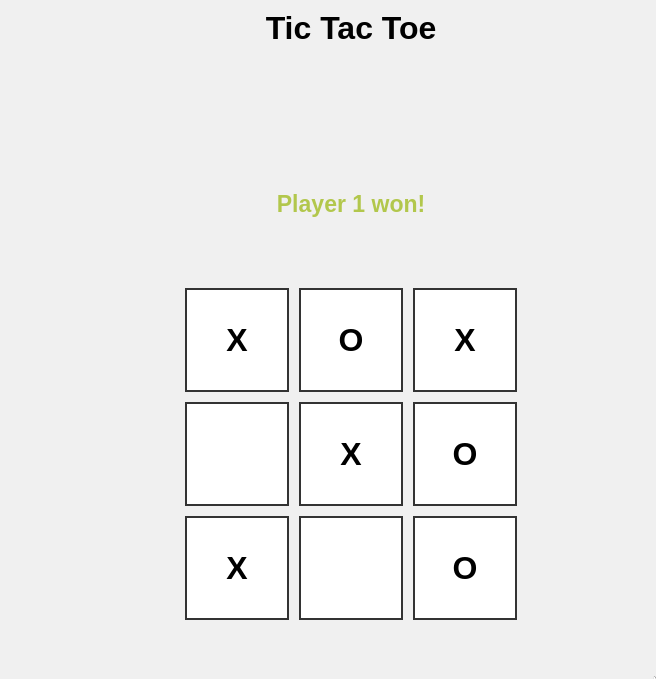

# Tic Tac Toe
A Tic-Tac-Toe game with all game logic written in Rust and compiled to WebAssembly using wasm-pack. The WebAssembly module is then integrated with plain JavaScript to run the application in the browser

<p align="center">
  
</p>

# Compilation
### Playing in CLI
```
$ cargo run
```

### Playing in Web
```
$ cd web
$ npm run build-wasm
$ npm run serve
```
